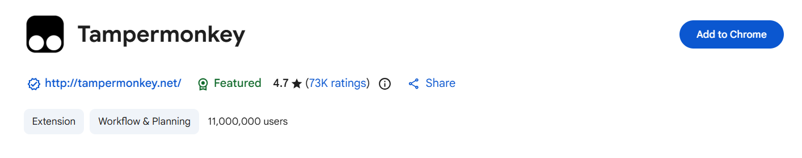
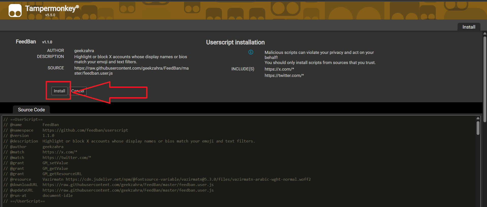
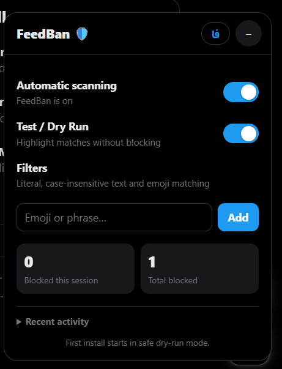
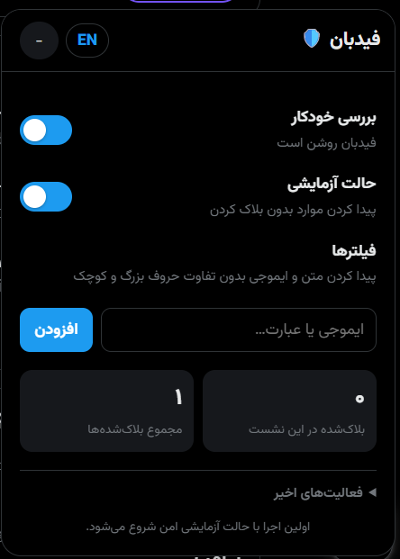

# FeedBan 🛡️

[English](#english) · [فارسی](#فارسی)

## English

FeedBan helps clean up your X (Twitter) feed. Add an emoji or phrase, and it’ll look for it in account display names and visible bios.

It works in two modes:

- **Dry Run:** highlights matches without blocking anyone.
- **Automatic:** tries to block matched accounts through X’s own menus.

FeedBan checks names and bios—not the text inside posts.

> **Quick heads-up:** Start with Dry Run. X doesn’t provide a guaranteed safe limit for automatic blocking, and scripted actions may put your account at risk.

### Install

1. Install **Tampermonkey** for your browser:
   - [Google Chrome](https://chromewebstore.google.com/detail/tampermonkey/dhdgffkkebhmkfjojejmpbldmpobfkfo)
   - [Mozilla Firefox](https://addons.mozilla.org/en-US/firefox/addon/tampermonkey/)
   - [Microsoft Edge](https://microsoftedge.microsoft.com/addons/detail/tampermonkey/iikmkjmpaadaobahmlepeloendndfphd)
   - [Safari on Mac](https://apps.apple.com/us/app/tampermonkey/id6738342400)
   - [Opera — Tampermonkey Beta](https://addons.opera.com/en/extensions/details/tampermonkey-beta/)

   

2. Click **[🛡️ Install FeedBan](https://raw.githubusercontent.com/geekzahra/FeedBan/master/feedban.user.js)**.
3. Tampermonkey will open. Click **Install**.

   

4. Open [x.com](https://x.com/) and refresh the page.

That’s it. The FeedBan panel should appear in the bottom-right corner.

If the install link only shows code, make sure Tampermonkey is installed and enabled, then click it again.

### How to use it

- **Automatic scanning** pauses or resumes FeedBan.
- **Test / Dry Run** highlights matches without blocking anyone.
- Under **Filters**, type an emoji or phrase and click **Add**. Click `×` on a filter to remove it.
- The two counters show blocks from this session and your total blocks.
- Open **Recent activity** to see matches, blocks, or failed attempts.
- Use **فا / EN** to change the language and `− / +` to minimize or expand the panel.

For a safe first test, leave Dry Run on and add part of a visible display name or an emoji from that name. A match should get a yellow outline. Only turn Dry Run off after checking your filters, and remember that automatic blocking is still at your own risk.

Keep filters specific—short, common words can match lots of accounts.

### Language

Click **فا** for the Persian RTL interface. Click **EN** to switch back to English LTR. FeedBan remembers your choice.

### Having trouble?

- **No panel?** Make sure FeedBan is enabled in Tampermonkey, then refresh X.
- **Text works but an emoji doesn’t?** The emoji must be in the display name or visible bio, not just a post.
- **X gets stuck loading?** Disable FeedBan, close that tab, and open X in a new one.
- **Highlighted but not blocked?** Turn Dry Run off and check **Recent activity** for the reason.

FeedBan stores your filters and settings in your userscript manager. It doesn’t collect your X login token or send your filters to a FeedBan server.

---

## فارسی

&rlm;فیدبان کمک می‌کنه فید X (توییتر) رو مرتب‌تر کنی. کافیه یه ایموجی یا عبارت بهش بدی تا اون رو توی اسم نمایشی یا بیوی قابل‌مشاهده حساب‌ها پیدا کنه.

&rlm;دو حالت داره:

- &rlm;**حالت آزمایشی:** فقط موارد پیدا شده رو رنگی می‌کنه و کسی بلاک نمی‌شه.
- &rlm;**حالت خودکار:** سعی می‌کنه با منوهای خود X حساب پیدا شده رو بلاک کنه.

&rlm;فیدبان فقط اسم و بیو رو بررسی می‌کنه، نه متن داخل پست‌ها رو.

> &rlm;**یه نکته مهم:** اول با حالت آزمایشی شروع کن. X هیچ سرعت تضمین‌شده‌ای برای بلاک خودکار اعلام نکرده و کارهای خودکار ممکنه برای حسابت ریسک داشته باشن.

### نصب

1. &rlm;**Tampermonkey** رو برای مرورگرت نصب کن:
   - &rlm;[گوگل کروم](https://chromewebstore.google.com/detail/tampermonkey/dhdgffkkebhmkfjojejmpbldmpobfkfo)
   - &rlm;[موزیلا فایرفاکس](https://addons.mozilla.org/en-US/firefox/addon/tampermonkey/)
   - &rlm;[مایکروسافت اج](https://microsoftedge.microsoft.com/addons/detail/tampermonkey/iikmkjmpaadaobahmlepeloendndfphd)
   - &rlm;[سافاری در مک](https://apps.apple.com/us/app/tampermonkey/id6738342400)
   - &rlm;[اپرا — نسخه بتای Tampermonkey](https://addons.opera.com/en/extensions/details/tampermonkey-beta/)

   &rlm;

2. &rlm;روی **[🛡️ نصب فیدبان](https://raw.githubusercontent.com/geekzahra/FeedBan/master/feedban.user.js)** بزن.
3. &rlm;صفحه Tampermonkey که باز شد، **Install** رو بزن.

   &rlm;

4. &rlm;برو به [x.com](https://x.com/) و صفحه رو refresh کن.

&rlm;همین! حالا باید پنل فیدبان رو پایین سمت راست صفحه ببینی.

&rlm;

&rlm;اگه لینک نصب فقط یه صفحه کد نشون داد، مطمئن شو Tampermonkey نصب و روشنه و دوباره روی لینک بزن.

### چطور ازش استفاده کنم؟

&rlm;

- &rlm;با **بررسی خودکار** می‌تونی فیدبان رو موقتاً متوقف یا دوباره روشن کنی.
- &rlm;**حالت آزمایشی** فقط حساب‌های پیدا شده رو رنگی می‌کنه و کسی رو بلاک نمی‌کنه.
- &rlm;توی بخش **فیلترها** یه ایموجی یا عبارت بنویس و **افزودن** رو بزن. برای پاک کردن هر فیلتر هم روی `×` بزن.
- &rlm;دو شمارنده، تعداد بلاک‌های همین نشست و مجموع بلاک‌ها رو نشون می‌دن.
- &rlm;بخش **فعالیت‌های اخیر** نتیجه پیدا شدن حساب‌ها، بلاک‌ها و خطاها رو نشون می‌ده.
- &rlm;با **فا / EN** زبان رو عوض کن و با `− / +` پنل رو کوچیک یا باز کن.

&rlm;برای اولین تست، حالت آزمایشی رو روشن نگه دار و بخشی از اسم نمایشی یه حساب یا ایموجی داخل اسمش رو اضافه کن. دور حساب پیدا شده باید زرد بشه. فقط وقتی فیلترها رو بررسی کردی حالت آزمایشی رو خاموش کن؛ بلاک خودکار همچنان با مسئولیت خودته.

&rlm;فیلترها رو دقیق انتخاب کن؛ کلمه‌های کوتاه و رایج ممکنه کلی حساب رو پیدا کنن.

### زبان

&rlm;برای محیط فارسی و راست‌به‌چپ روی **فا** بزن. برای برگشتن به انگلیسی و چپ‌به‌راست هم **EN** رو بزن. فیدبان انتخابت رو یادش می‌مونه.

&rlm;در رابط فارسی فیدبان از فونت زیبای **Vazirmatn** استفاده شده؛ به یاد **صابر راستی‌کردار**، خالق این فونت ماندگار.

### اگه چیزی درست کار نکرد

- &rlm;**پنل رو نمی‌بینی؟** مطمئن شو فیدبان توی Tampermonkey روشنه و بعد X رو refresh کن.
- &rlm;**متن پیدا می‌شه ولی ایموجی نه؟** ایموجی باید توی اسم یا بیوی قابل‌مشاهده باشه، نه فقط داخل پست.
- &rlm;**X روی صفحه شروع گیر کرد؟** فیدبان رو خاموش کن، تب رو ببند و X رو توی یه تب جدید باز کن.
- &rlm;**حساب رنگی شد ولی بلاک نشد؟** حالت آزمایشی رو خاموش کن و دلیلش رو توی **Recent activity** ببین.

&rlm;فیدبان فیلترها و تنظیماتت رو داخل افزونه مدیریت اسکریپت نگه می‌داره. توکن ورود X رو جمع نمی‌کنه و فیلترهات رو هم به سرور جداگانه‌ای نمی‌فرسته.

